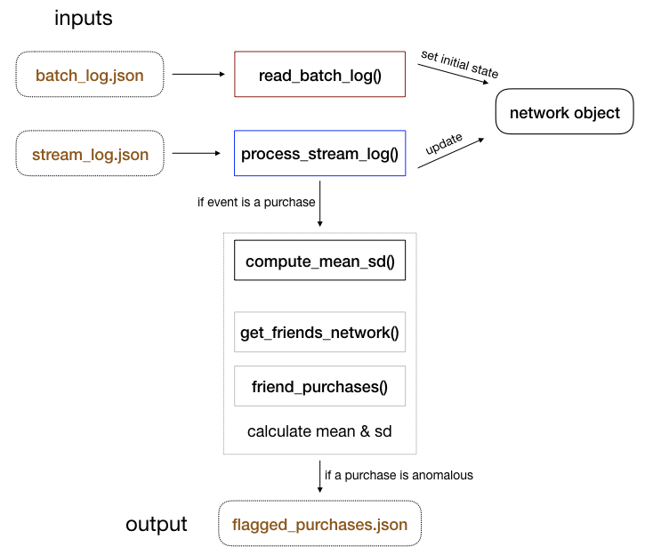
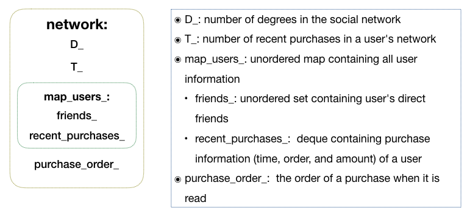
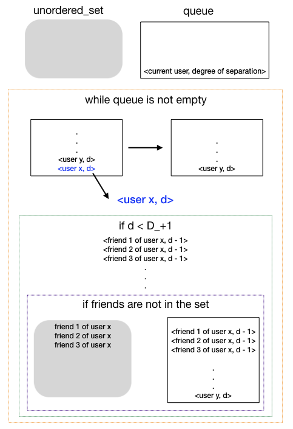

# Project Description 

This program simulates a real-time platform that analyzes user purchases within a social network. It:
* reads input files which contains befriend, unfriend, and purchase events
* processes those events and analyzes each purchase 
* writes anomalous purchases within a social network to a output file

# Dependence
This program requires:
* a C++ comiplier that supports the C++11 standard. This application has been tested with Apple Clang version 8.1.0, and GCC versions 6.3.0 and 7.1.0.
* RapidJSON - A copy of the RapidJSON header files is included under `src/include/`. There is no need to install RapidJSON seperately.

# Build and Run 

### Built

1. Set the CXX variable in `src/Makefile` to the desired compiler. For example,
```
# tested compilers: clang++, GCC 
CXX = g++
```
2. Execute `make` from the `src/` directory 

### Run 

* Run with script in root directory: execute `run.sh` 

* Run directly from `src` directory: `anomaly_detection [batch input file] [stream input file] [output file]` <br>

For example:
```Makefile
./src/anomaly_detection ./log_input/batch_log.json ./log_input/stream_log.json ./log_output/flagged_purchases.json
```
### Tests
Execute `run_tests.sh` in the `insight_testsuite` directory, which runs three test cases:
* test_1: provided by insight
* test_2: check for setting up a user network for `D` degree of separation 
* test_3: test for 
   - correct network setting up (befriend and unfriend events appear in the stream input file) 
   - input error handling (there are wrong events and befriend/unfriend events with the same user id in inputs)

# Input and Output Files
In this application, the simulated purchases and social network events are provided in two log files:

* The batch input file, _e.g._ `batch_log.json`, contains past events (purchases, befriends, and unfriends) which are used to build the initial state of the entire user network. It has the following format:
```
{"D":"3", "T":"50"}
{"event_type":"purchase", "timestamp":"2017-06-13 11:33:01", "id": "1", "amount": "16.83"}
{"event_type":"purchase", "timestamp":"2017-06-13 11:33:01", "id": "1", "amount": "59.28"}
{"event_type":"befriend", "timestamp":"2017-06-13 11:33:01", "id1": "1", "id2": "2"}
{"event_type":"befriend", "timestamp":"2017-06-13 11:33:01", "id1": "3", "id2": "1"}
```

* The stream input file, _e.g._ `stream_log.json`, is an event log. It is used to update the user social network and purchase history, and to flag anomalous purchases. Its format looks like the following
```
{"event_type":"purchase", "timestamp":"2017-06-13 11:33:02", "id": "2", "amount": "1601.83"}
```

* The output file, `flagged_purchases.json`, contains all anomalous purchases (where the [purchase amount] > [mean] + 3 * [standard deviation]) along with the mean and standard deviation of the recent purchases within the social network of the user. Its format looks like the following
```
{"event_type":"purchase", "timestamp":"2017-06-13 11:33:02", "id": "2", "amount": "1601.83", "mean": "29.10", "sd": "21.46"}
```

### Input Variables
* `D`: the number of degrees of seperation that defines a user's social network

* `T`: the number of consecutive purchases made by a user's social network (not including the user's own purchases)

# Directory Structure

```
.
├── README.md
├── insight_testsuite
│   ├── run_tests.sh
│   └── tests
│       ├── test_1
│       │   ├── log_input
│       │   │   ├── batch_log.json
│       │   │   └── stream_log.json
│       │   └── log_output
│       │       └── flagged_purchases.json
│       ├── test_2
│       │   ├── log_input
│       │   │   ├── batch_log.json
│       │   │   └── stream_log.json
│       │   └── log_output
│       │       └── flagged_purchases.json
│       └── test_3
│           ├── log_input
│           │   ├── batch_log.json
│           │   └── stream_log.json
│           └── log_output
│               └── flagged_purchases.json
├── log_input
│   ├── batch_log.json
│   └── stream_log.json
├── log_output
│   └── flagged_purchases.json
├── run.sh
├── sample_dataset
│   ├── batch_log.json
│   └── stream_log.json
└── src
    ├── Makefile
    ├── include
    │   └── rapidjson (include RapidJSON headers)
    ├── main.cpp
    ├── network.cpp
    ├── network.h
    ├── user_info.cpp
    └── user_info.h
```

# Design
<p align="center">

</p>

## 1. Data structures

### `user_info` class
 This class keeps track of a user's direct friends (_i.e._ one degree of seperation) and the most recent `T` purchases of a user. 

### `network` class
 It keeps a record of all users and purchases, which is updated when the stream input file (`stream_log.json`) is processed. It also holds variables that define the degree of separation (`D`) for a user's social network, set the maximum number of purchase history (`T`), and track the order in which purchases are read.  

<p align="center">

</p>

## 2. Algorithms

### network traversal with `get_friends_network()`

`get_friends_network()` function returns an unordered set, which contains all the friend IDs of a user within `D` degree of separation. In the function, a queue is used to hold a set of visited friends in the network ad track the degree of seperation. Initially, the user is pushed to the queue. Then, while the queue is not empty, the user at the front of the queue is removed, and the IDs of that user's direct friends are added. Those direct friends' IDs are also added to the output set. The above two steps are repeated until all friends in the user's network have been visited, while skipping friends that have already been visited. At the `D` degree of separation, users' friends are no longer pushed into the queue.  When the queue is empty, all friends within `D` degree of separation are present in the output set.

<p align="center">

</p>

### collect most recent `T` purchases with `friend_purchases()` 

In `friend_purchase()` function,  a vector with a maximum size of 2`T` is created. It copies the purchases of the first friend in the network, and then those of the second friend. After performing a sorted merge, it is resized if the size is larger than `T`. These two steps are repeated until the purchases of all friends in the network are processed.

### computation of mean and standard deviation with `compute_mean_sd()`

`compute_mean_sd() ` function is designed to compute mean and standard deviation using one loop. It is based on the following equations: <br >


# License
### RapidJSON 
[RapidJSON]("http://rapidjson.org") source code is licensed under the MIT License. <br >
Copyright (C) 2015 THL A29 Limited, a Tencent company, and Milo Yip


